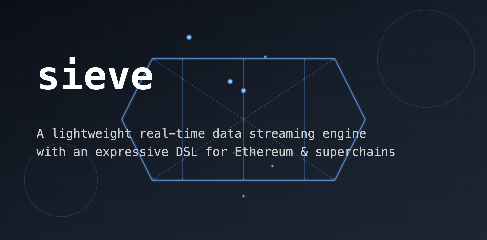

# sieve
<!-- [](https://github.com/TheDhejavu/sieve/actions/workflows/CI.yml) -->


A real-time data streaming engine with an expressive DSL for Ethereum & superchains



## Overview
Sieve offers a simple and expressive way for filtering blockchain data streams and emits events when specified conditions are met. We try to make sieve as humanly expressive as possible. It's also an experiment - if it fails, we throw it away and rebuild from scratch. The major pain point is, we want you to be able to create listeners (streams from filters) dynamically (millions if possible) that emit events based on this. Let's imagine something: your user sends 100ETH on base chain and immediately you set up a listener on the fly to listen to this event on the base network and react accordingly. The listeners stay active till seen / timeouts. We also try to do alot of things like decoding data when we come accross fields with conditions that needs decoded data for evaluation.

<!-- it's recommended to be explicit in this case by including correlated conditions to help Sieve understand exactly what to look for. However, without specific explicit instructions, Sieve falls back to heuristic approaches which, while functional, may impact performance. -->

### Supported Emitted Events
- Transactions: Both confirmed and pending.
- Events (Logs): Filtered logs from smart contract interactions.
- Block Headers: Key details from block headers.

## Streaming Layer 
The system ingests blockchain data through both RPC and Gossipsub protocols, each chain configuration specifying its RPC endpoints, WebSocket connections, Gossipsub address, and bootstrap peers.

It is composed of **three main components** that work together to provide a reliable block & transaction stream. 

- Network layer
- Connection Orchestrator
- Ingestion Pipeline

## L1 (Ethereum)
We prioritize Ethereum data expressiveness by hardcoding commonly used fields, since these fields are relatively stable across the Ethereum ecosystem and often share relationships with L2s. 

### Filter (*v1.0*)
```rust
// Simple OR filter for transaction monitoring
let filter = FilterBuilder::new().transaction(|f| {
    f.or(|tx| {
        // Value > 1000
        tx.value().gt(U256::from(1000));

        // OR Gas price < 50
        tx.gas_price().lt(50000); 
        
        // OR Nonce = 5          
        tx.nonce().eq(5);                  
    });
});

// Pattern matching using AND/OR combinations
let filter = FilterBuilder::new().transaction(|f| {
    // Base value requirement
    f.value().gt(U256::from(100));           

    f.all_of(|f| {
        // Gas price must be in range
        f.gas_price().between(50, 150);     
    });

    f.or(|t| {
        // Either high gas
        t.gas().gt(500000);     
        // OR specific value            
        t.value().eq(U256::from(100));       
    });
});
```

### ingest / watcher (*v1.0*):
**RPC Calls (*busy-polling*):**

- Pending Transactions:
    - `eth_newPendingTransactionFilter`
- Block & Transactions:
    - `eth_getBlockByNumber`

**Gossipsub (*reactive*):**

- Block gossip:
    - `BeaconBlock`
    - `ExecutionPayload`
    - `ExecutionPayloadHeader`
- Transaction gossip:
    - `TransactionAnnounce`
    - `TransactionPropagation`

**WebSocket (*reactive*):**

- `eth_subscribe`:
    - `newHeads`
    - `newPendingTransactions`
    - `logs`

## L2 (Superchain)
Supporting L2s through chain context and dynamic fields. Rather than hardcoding chain-specific logic, developers can specify chain context and use flexible field conditions, while still maintaining harcoded cross-chain specific name

### Idea ?
**Basic filter**:

```rust
use sieve::FilterBuilder;

fn main() {
    // Create a filter for Optimism-related fields. 
    let op_filter = FilterBuilder::new()
        .chain(Chain::Optimisim) // chain context - no chain means L1
        .transaction(|tx| {
            // This works!!
            tx.value().gt(U256::from(1000));
            tx.gas_price().lt(50000);

            // NOTE: We do not support this yet....
            // Filter for events where the `l1BlockNumber` is greater than 10^18
            tx.field("l1BlockNumber").gt(1000000000000000000u128);

            // Filter for events where `l1TxOrigin` starts with "0x" 
            tx.field("l1TxOrigin").starts_with("0x");

            // Filter for events where `queueIndex` is less than 100
            tx.field("queueIndex").lt(100u64);
        });
}

```

### Proposed Usage (*stream*):
```rust
use sieve::{Sieve, config::{ChainConfig, Chain}, FilterBuilder, NumericOps, StringOps};

#[tokio::main]
use sieve::{FilterBuilder, NumericOps, StringOps};
use std::time::Duration;

#[tokio::main]
async fn main() -> Result<(), Box<dyn std::error::Error>> {
    // 1. Chain Configuration
    let chains = vec![
        // Optimisim chain....
        ChainConfigBuilder::builder()
            .rpc("https://mainnet.optimism.io/...")    
            .ws("wss://ws-mainnet.optimism.io/...")     
            .gossipsub("/ip4/0.0.0.0/tcp/9000")    
            .bootstrap_peers(vec!["/ip4/127.0.0.1/tcp/8000"])
            .chain(Chain::Optimisim)
            .build(),    

        // Base chain.....
        ChainConfigBuilder::builder()
            .rpc("https://mainnet.base.org")        
            .chain(Chain::Base)
            .build(),         

        // Ethereum chain....
        ChainConfigBuilder::builder()
            .rpc("https://mainnet.infura.io/v3/...") 
            .chain(Chain::Ethereum)   
            .build(),                        
    ];

    // 2. Connect to chains via `Sieve`
    let sieve = Sieve::connect(chains)?;                   

    // 3. Create Filter
   let pool_filter = FilterBuilder::new().pool(|f| {
        f.any_of(|p| {
            // High value pending transaction
            p.value().gt(U256::from(1000000000000000000u64));
            // Specific sender/receiver
            p.from().starts_with("0xdead");
            p.to().exact("0x742d35Cc6634C0532925a3b844Bc454e4438f44e");
        });
    });

    // 4. Subscribe to stream
    let mut stream = sieve.subscribe(pool_filter.clone());
    while let Some(Ok(event)) = stream.next().await {
        println!("Pool: {:?}", event);
    }

    Ok(())
}

```

## Filter Engine
The filter engine uses a tree structure to represent complex logical combinations of conditions that can match against blockchain data (transactions, blocks, events). 

### Usage

```rust
use sieve::{FilterBuilder, NumericOps, StringOps};

fn main() {
    // Single chain (L1)
    let eth_filter = FilterBuilder::new()
        .transaction(|f| {
            f.or(|tx| {
                tx.value().gt(U256::from(1000));
                tx.gas_price().lt(50000);
            });
        });

    // Single chain (L2 - Optimisim)
    let op_filter = FilterBuilder::new()
        .chain(Chain::Optimisim) // chain context - no chain means L1
        .transaction(|tx| tx.field("l1BlockNumber").gt(2000));
}
```

## Stream Listeners

## Subsribe
subscribe allows you to subsribe to any kind of events (transaction, header e.t.c) based on specified filter conditions.

**Subsribe:**
```rust
use sieve::{FilterBuilder, NumericOps, StringOps};

fn main() {
    // Subscribe to events matching the Ethereum filter
    let mut stream = sieve.subscribe(eth_filter);

    // Process incoming events from the subscription
    while let Some(Ok(event)) = stream.next().await {
        println!("{:?} new event", event);
    }
}

```

**Subscribe All:**
The `subscribe_all` context allows you to subscribe to independent filters

```rust
use sieve::{FilterBuilder, NumericOps, StringOps};

fn main() {
    // Subscribe to all events that match the provided filters
    let mut stream = sieve.subscribe_all([eth_filter, op_filter]);

    // Process incoming events from the stream
    while let Some(Ok(event)) = stream.next().await {
        println!("{:?} new event", event);
    }
}

```

### Watch Within

**`watch_within`** is a context that enables time-bounded event monitoring across different data sources. Unlike subsribe that only process events from the latest block / data, **`watch_within`** maintains an active time window to detect correlated patterns.

it continues monitoring until either:
- All filter conditions are met within the time window
- The time window expires without finding all matches

This makes it ideal for scenarios requiring temporal correlation across different data sources or data types, such as **cross-chain operations**, **multi-step transactions**, or **time-sensitive pattern detection**.

**Sample**
```rust
use sieve::{FilterBuilder, NumericOps, StringOps};

fn main() {
    // Create an event stream monitored within a 30-minute time window
    let mut stream = sieve.watch_within(
        Duration::from_secs(1800), // Define a 30-minute time window
        [
            eth_filter,  
            op_filter     
        ],                            
    );

    // Process incoming events from the stream
    while let Some(Ok(event)) = stream.next().await {
        match event {
            // Handle matched events within the time window
            Event::Match(events) => {
                // let l1_event = events[0];
                // let l2_event = events[1];
                println!("Found matching events within time window");
            }
            // Handle events that timed out without a match
            Event::Timeout => {
                println!("Time window expired without finding all matches");
            }
        }
    }
}

```

## TODO
- Handle Chain Specific fields,current implementation only support l1 & l2 common fields.
- Improve how data is ingested (support gossipsub) and create a proper unification (RPC filter vs polling all data )
- Filters will determine what is orchestrated (e.g we do not need to spin up transaction RPC poller if their are no transaction listeners )
- Dynamic listeners creation (thousands to millions) and real time data correlation accross chains - end game.

## Status
🚧 Experimental - Not ready for production use 


## Acknowledgements

Created by Ayodeji Akinola ([@ayodeji0x0](https://x.com/ayodeji0x0)).

Special thanks to the creators and maintainers of [Alloy](https://github.com/alloy-rs/alloy) for their excellent Ethereum development toolkit, which significantly simplified working with data types and other foundational components.

Licensed under the [MIT license](LICENSE).